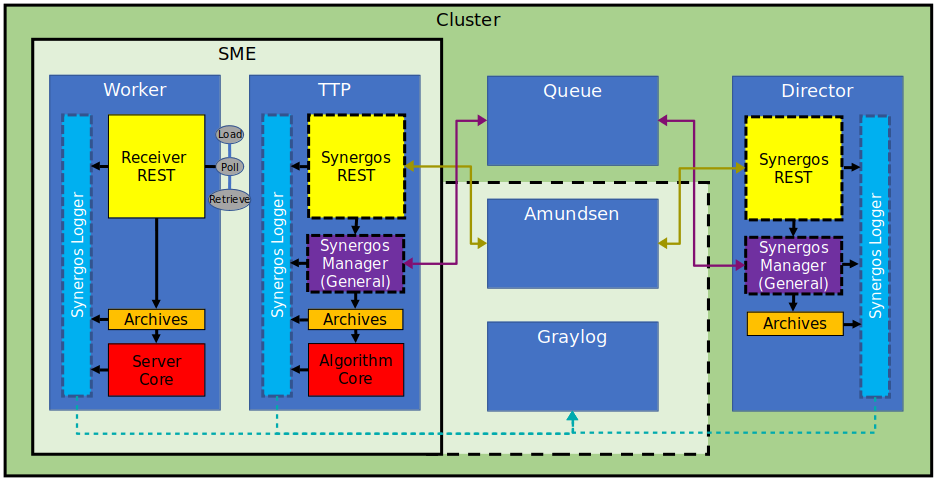

# Synergos Algorithm

Algorithmic component for the Synergos network

*Component repositories of Synergos [V3]*

The Synergos grid prides itself on its modular system of deployment, comprizing various deployment combinations as seen from the diagram above. General configurations are as follows:
1. **`Synergos Basic`** 
    > Simplest deployment pattern, consisting a duet of 2 containers - *Synergos-TTP* & *Synergos-Worker*. 
2. **`Synergos Plus`**
    > Intermediate deployment pattern that equips the grid with the capability to for metadata extraction/analysis. This allows users to gain access to hardware statistics, data-cataloguing, lineage tracking and general centrialised logging.
3. **`Synergos Cluster`**
    > Full distributed deployment pattern with job queue integration in addition to metadata extraction. This configuration is optimized for running concurrent federated cycles to facilitate hyperparameter tuning.

By having users install different components depending on their supposed role within the federated grid, most of the complexity associated with federated orchestrations are obscured completely from the users. Specifically, the goal is to stitch entire containers together with unique Dockerfile configurations.

This repository governs **Synergos Algorithm**, the core algorithmic component 
of Synergos, regardless of configuration.

---

## Installation
As Synergos is still under development, its components have yet to be deployed on PyPi. Hence, the best way to use Synergos Algorithm is to install it in development mode in a local virtualenv.

```
# Download source repository
git clone https://gitlab.int.aisingapore.org/aims/federatedlearning/synergos_algorithm
cd ./synergos_algorithm

# Setup virtual environment
conda create -n synergos_env python=3.7

# Install in development mode
pip install -e .
```
